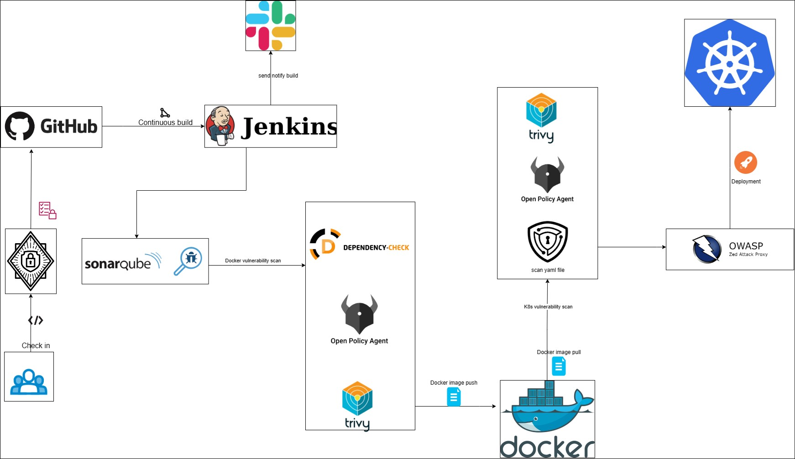

# DevSecOps Project

This repository contains the source code for the DevSecOps project, which focuses on integrating security practices into the software development and operations process.
Follow is visualize pipeline of project

## Table of Contents

- [Overview](#overview)
- [Features](#features)
- [Installation](#installation)
- [Usage](#usage)
- [Contributing](#contributing)

## Overview

The DevSecOps project aims to promote a culture of security throughout the software development lifecycle. It combines development, security, and operations practices to enable the rapid and secure delivery of software applications.

## Features

- Continuous Integration and Continuous Deployment (CI/CD) pipeline
- Automated security testing and vulnerability scanning
- Infrastructure as Code (IaC) with configuration management
- Security monitoring and incident response
- Secure coding practices and code review

## Installation

To install and run the DevSecOps project locally, follow these steps:

1. Clone the repository:
   ```bash
   git clone https://github.com/nguyenbuitk/devsecops.git
   ```
2. Change the image in k8s-deployment-service.yaml to buinguyen/numeric-app and apply
    ```bash
    kubectl apply -f k8s-deployment-service.yaml
    ```


## Usage
Once the application is up and running, you can access it at http://{nodeName}:{nodePort}. Use the provided credentials to log in and explore the features of the DevSecOps platform.

## Contributing
Contributions to the DevSecOps project are welcome! If you have any ideas, suggestions, or bug reports, please create an issue or submit a pull request. See our contribution guidelines for more information.
